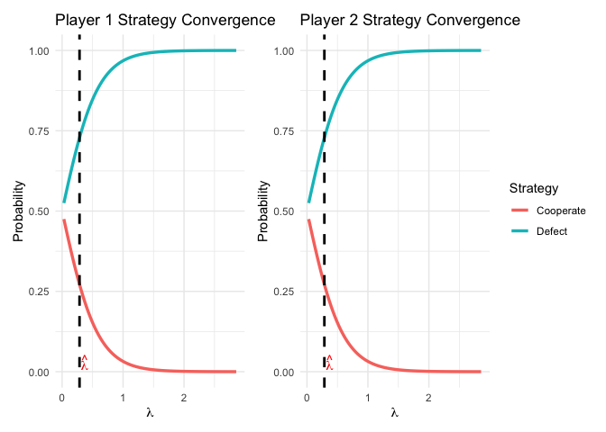

<!-- README.md is generated from README.Rmd. Please edit that file -->

# qre

<!-- badges: start -->

<!-- badges: end -->

In classic game theory, the Nash Equilibrium concept assumes that
players are perfectly rational and will always choose the strategy that
maximizes their payoff, given their opponents’ actions. However,
empirical studies of human behavior show that players often make
mistakes. The Quantal Response Equilibrium (QRE) is a widely used model
that relaxes the assumption of perfect rationality by introducing
probabilistic choice. The goal of qre is to solve for the QRE of a game
by finding the rationality parameter, lambda, that best explains a set
of observed outcomes. Additionally, “plot” s3 object helps users
visualize and assess the model’s fit.

## Installation

You can install the development version of qre from
[GitHub](https://github.com/) with:

``` r
# install.packages("pak")
pak::pak("soh24-bit/qre")
```

## Example

This example uses data from Embrey, Fréchette, and Yuksel (2018),
available from Harvard Dataverse.
(<https://doi.org/10.7910/DVN/WCHA2J>). This is data from classic
experiment testing prisoners’ dilemma.

``` r
library(qre)

# The data has already been formatted from raw data
data(example_data)
head(example_data)
#>   p1_choice p2_choice
#> 1    Defect    Defect
#> 2    Defect    Defect
#> 3    Defect    Defect
#> 4    Defect    Defect
#> 5    Defect    Defect
#> 6    Defect    Defect

# Payoffs for each 
# Given in the paper and rescale to avoid overflow
payoffs_p1 <- matrix(c(51, 5, 87, 39), nrow = 2, byrow = TRUE)/10
payoffs_p2 <- matrix(c(51, 87, 5, 39), nrow = 2, byrow = TRUE)/10 

rownames(payoffs_p1) <- c("Cooperate", "Defect")
colnames(payoffs_p2) <- c("Cooperate", "Defect")
```

The theoretical equilibrium is that the player always choose to defect
as it is the dominant strategy.

However, due to the “mistakes” made by the players, we see that the qre
is estimating that the players choose to defect at around 72.84%.

``` r
fit <- estimate_qre(payoffs_p1, payoffs_p2, observed_data = example_data, lower_bound = 0.001)
print(fit)
#> $lambda
#> [1] 0.2856439
#> 
#> $probs_p1
#> [1] 0.2715637 0.7284363
#> 
#> $probs_p2
#> [1] 0.2715637 0.7284363
#> 
#> $observed_freqs
#> $observed_freqs$p1
#> Cooperate    Defect 
#>  0.271564  0.728436 
#> 
#> $observed_freqs$p2
#> Cooperate    Defect 
#>  0.271564  0.728436 
#> 
#> $observed_freqs$n
#> [1] 16880
#> 
#> 
#> $loglik
#> [1] -19743.13
#> 
#> $payoffs_p1
#>           [,1] [,2]
#> Cooperate  5.1  0.5
#> Defect     8.7  3.9
#> 
#> $payoffs_p2
#>      Cooperate Defect
#> [1,]       5.1    8.7
#> [2,]       0.5    3.9
#> 
#> attr(,"class")
#> [1] "qre_fit"

plot(fit)
```



The plot shows the eventual convergence to dominant strategy as lambda
goes up.
